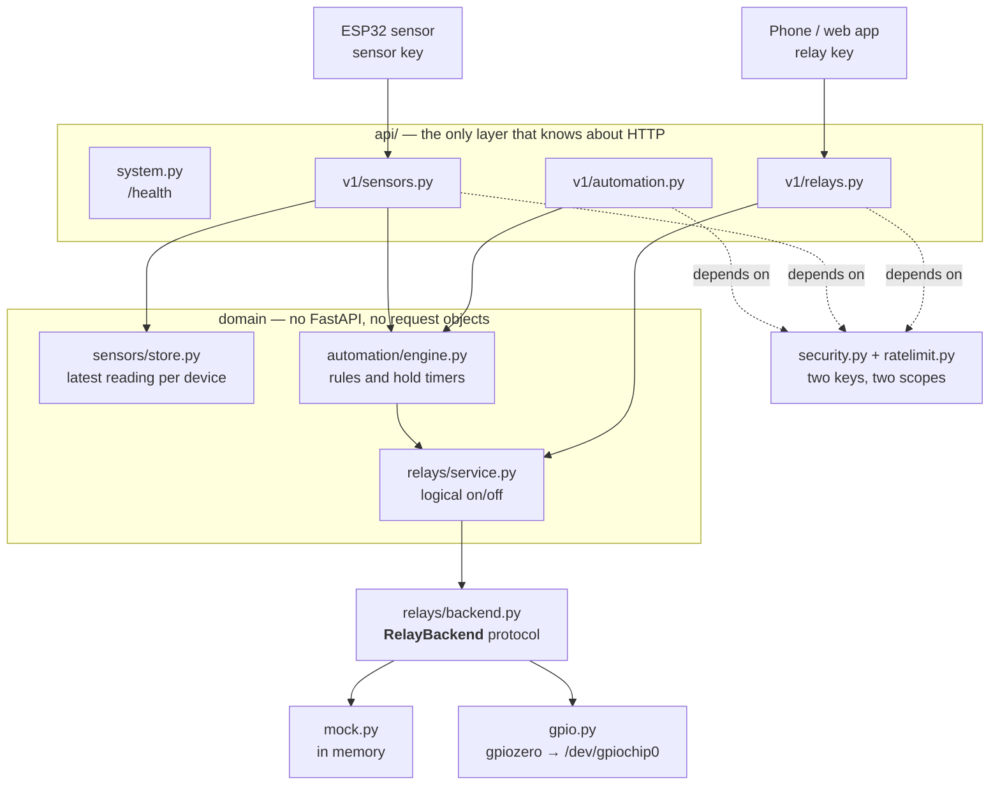

# Architecture

How the pieces fit, in what order they are built, and which of them is allowed to know
about the others. The reasoning behind individual choices is in the README's design
notes; this describes the shape.

## Shape

`/health` is outside the guard: it is the one endpoint that takes no key, which is what
makes it useful for saying whether the service is up without handing out a credential.

## Layering, and the direction of every dependency

Three rules, each of which holds today and is asserted by
[`tests/test_layering.py`](../tests/test_layering.py):

1. **No domain package imports FastAPI, Starlette, uvicorn, or `pihome_hub.api`.** The
   relay, sensor and automation packages are plain Python. That is why the whole of the
   automation engine can be tested by calling it, with no client and no event loop
   ceremony beyond `asyncio`.
2. **`relays` and `sensors` know nothing of each other, and nothing of `automation`.**
   The dependency runs one way: automation reaches into both, because a rule is by
   definition a statement about a sensor and a relay. Neither of them needs a rule to
   exist.
3. **Only `app.py` chooses a backend.** The route modules never import `mock` or `gpio`;
   they receive a `RelayService` that already has one.

The point of rule 1 is not tidiness. It is that the layer holding the mains wiring has no
opinion about HTTP, so nothing about a request — a header, a status code, a JSON shape —
can reach the code that closes a circuit.

## Two kinds of configuration

| Source | Holds | Read by | Shape |
| --- | --- | --- | --- |
| `PIHOME_*` environment / `.env` | secrets and process settings: keys, bind address, log level, which backend | `config.py`, as pydantic-settings | flat, one process |
| YAML files | the house: relay wiring, sensor devices, automation rules | a `config.py` in each of the three domain packages | nested, per installation |
| SQLite | accounts, and what the service itself writes | `storage/` | rows, mutable at runtime |

The third is the only one the service writes to, and the only one an operator does not
edit by hand. It also decides where: `ProtectSystem=strict` leaves the filesystem
read-only, so the unit declares `StateDirectory=pihome-hub` and systemd creates
`/var/lib/pihome-hub` owned by the service account at mode `0700`. The database path
defaults to the `STATE_DIRECTORY` systemd exports from that declaration, so the unit
stays the one place the location is written down.

The split is not stylistic. A relay's pin, polarity and startup behaviour describe a
building and belong in a file that gets edited when someone rewires something; a bind
address and an API key describe a process and belong in the environment, where systemd
can hand them over without the service account ever reading them.

Both are fully validated before the port is bound — see below.

## Startup

`__main__.main()` runs in this order, and each step can only fail in one way:

1. **`get_settings()`** — pydantic validates the environment. A failure is rendered by
   `render_configuration_error` into one block naming each offending variable, then
   `SystemExit(2)`.
2. **`build_relay_service(settings)`** — loads `relays.yaml`, chooses the backend, and
   claims every pin. Catching `RelayError` here rather than a narrower subclass is
   deliberate: gpiozero raises its own exception types, and letting one escape gave a
   traceback with an exit code the unit retries.
3. **`check_configuration(settings, relays)`** — loads `sensors.yaml` and
   `automation.yaml` and builds an engine, purely to prove every rule names something
   real. The engine is discarded; the lifespan builds the one the service runs on, inside
   the loop that owns its timers.
4. **`prepare_database(settings.database_path)`** — opens SQLite and applies any
   migration the file has not seen. A state directory the service cannot write to, or a
   schema written by a newer build, stops here.
5. **`uvicorn.run(create_app(...))`** — the port is bound only now. Everything above has
   already been read from disk, so a misconfiguration cannot surface as a traceback from
   inside a running event loop.

Exit code 2 means "everything above step 5 failed", and the unit refuses to restart on
it. Anything the process cannot foresee — a bound port — exits 3, which is retried.

One subtlety worth knowing if you touch step 4: `sqlite3.connect()` opens nothing. It
returns a handle and defers the real work, so a directory the service cannot write to
raises on the *first statement*, not on the call. The pragmas therefore run inside the
same block that translates errors — outside it, that arrived as a raw `OperationalError`
and an exit code the unit retries forever.

## Ownership, and who closes what

Ownership follows construction, because the alternative is a service whose GPIO pins get
released underneath something still holding a reference to it.

- `__main__` builds the `RelayService`, passes it to `create_app`, and closes it in a
  `finally`.
- The lifespan checks whether it was handed one. If it was, it does not close it; if it
  built one itself, it does. That is the `owned` flag in `_lifespan`.
- The `AutomationEngine` is always built by the lifespan, because it holds asyncio tasks,
  and is always closed by it. Holds are cancelled **before** the relay service closes: a
  revert firing against a closed service would be a confusing traceback on the way out.

Both halves of that contract are pinned by `TestRelayServiceOwnership` in
[`tests/test_review_fixes.py`](../tests/test_review_fixes.py): a supplied service survives
the lifespan and stays usable, one the lifespan built is closed and cleared from
`app.state`, and an app can be started twice over the same supplied service.

## Three paths through the service

**Reading relay state.** `GET /v1/relays` → the relay-key dependency → `RelayService`,
which answers from the state it recorded when it last wrote a pin. It does not read the
pin back: the level on a pin is not the logical state of a relay once polarity is in play,
and the service is the thing that knows the mapping.

**A sensor reporting.** `POST /v1/sensors/{id}/readings` with the **sensor** key →
`SensorStore.record` → the same call hands the reading to `AutomationEngine.handle_reading`,
which returns the ids of the rules that fired. Those ids go into the journal line, which
is what makes "the reading arrived and matched nothing" a visible state rather than a
guess.

**A rule firing.** The engine turns the relay on or off through `RelayService` — the same
path the HTTP route uses, not a private one — and, if the rule declares `hold_seconds`,
schedules an asyncio task to revert. One pending revert per relay, keyed by relay id: a
second trigger replaces the first one's timer instead of racing it, so continued motion
keeps a light on rather than queueing a queue of reverts.

## The hardware seam

`RelayBackend` is a `Protocol` with four methods: `read_level`, `setup_output`, `write`,
`close`. Two implementations satisfy it. The mock keeps a dict; the gpiozero one holds an
`OutputDevice` per pin.

Everything above the seam speaks in logical states — "the porch light is on". Only the
backend and the `active_low` flag know that this might mean a LOW signal on the pin. The
raw level never leaves `gpio.py`, which is why an inverted relay board is a
one-line configuration change rather than a bug hunt.

The mock is not a testing convenience bolted on afterwards; it is the default. Driving
real pins requires `PIHOME_GPIO_BACKEND=gpiozero` and the `rpi` extra, so a host that
cannot load the GPIO library fails loudly instead of quietly pretending to switch things.

## Authentication

Two keys, two scopes, compared with `secrets.compare_digest`. The relay key reads and
controls; the sensor key may only push readings. Neither is a superset of the other,
which is the point: firmware that reports motion cannot survey the house, and a phone
cannot forge a motion event to reach a relay through a rule.

`ratelimit.py` counts failures in buckets, and the bucket key is where the care is:

| Bucket | Why it is separate |
| --- | --- |
| `relay:<peer>` | — |
| `sensor:<peer>` | Sharing one bucket would let a caller holding either key clear the other's failure count on every success, so a leaked sensor key would double as a rate-limit eraser |
| `probe:<peer>` | For the pre-dependency check below, so buggy firmware cannot exhaust the allowance protecting the relay key |

`<peer>` is the connection's own address, normalised: IPv6 collapses to its `/64`, because
a routed prefix holds ~1.8e19 addresses and counting per address would hand out a fresh
allowance per guess. IPv4 stays per address, since those are scarce and shared behind NAT.
`X-Forwarded-For` is deliberately ignored — trusting it without knowing the proxy would
let any caller forge its identity.

One wrinkle worth knowing about. FastAPI parses a request body **before** solving
dependencies, so a body that is not valid JSON raises before authentication ever runs.
That made a malformed body a route-existence oracle: 422 for a real path that takes a
body, 404 for one that does not — usable with no key and counted by nothing. The
`RequestValidationError` handler in `app.py` therefore re-checks authentication itself,
using `authenticate_any_scope`: a narrower question than the route's, asking only "are you
anonymous?", so it cannot be used to widen a scope.

## What is deliberately absent

- **No readings in the database.** There is a SQLite file now, and it holds accounts and
  nothing else. Sensor readings stay the latest per device, in memory: a restart forgets
  them and every device reports as never-having-reported until it pushes again, which is
  a truthful thing to say rather than a gap.
- **No history.** Trends need retention and a pruning story on a card with finite write
  cycles; that does not earn its place for switching yard lights.
- **No pin read-back.** See "Reading relay state" above.
- **No `X-Forwarded-For`, no TLS, no LAN bind by default.** Reaching the service from
  elsewhere is a VPN or a reverse proxy's job — see [SECURITY.md](../SECURITY.md).
